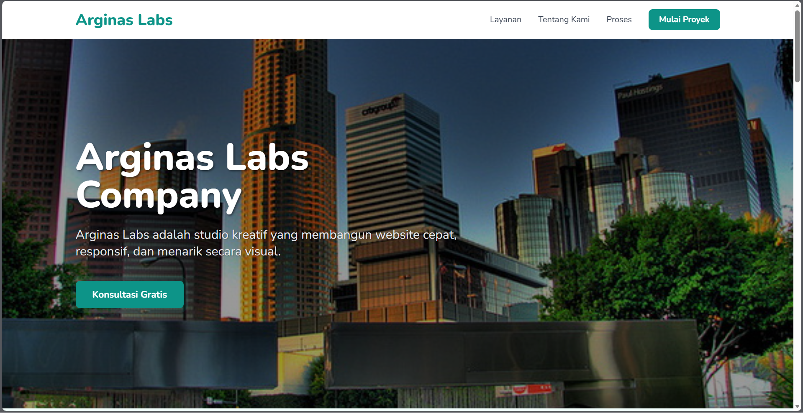
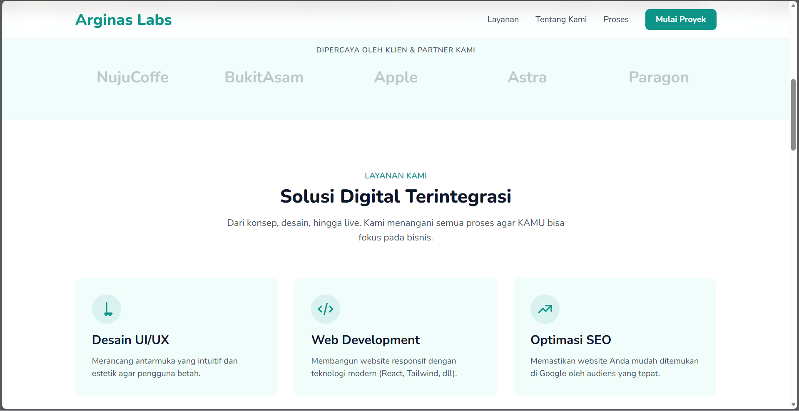
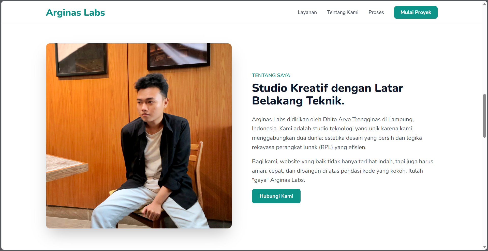
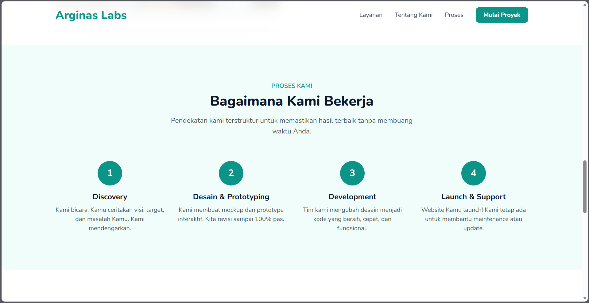
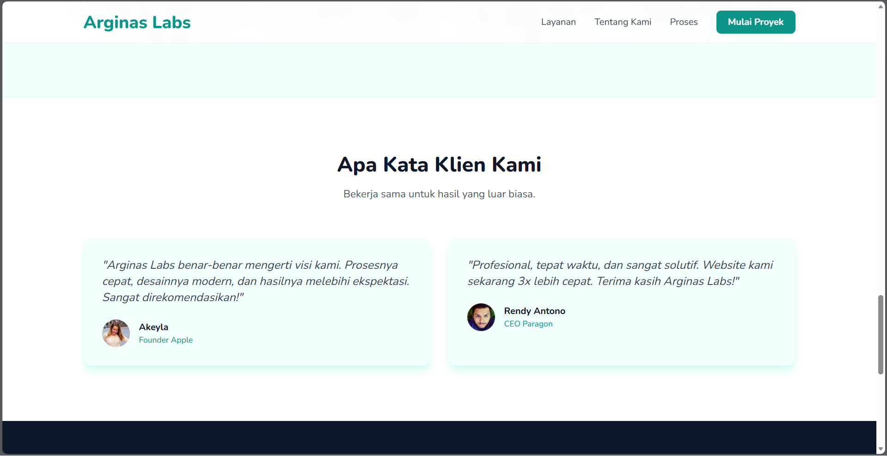
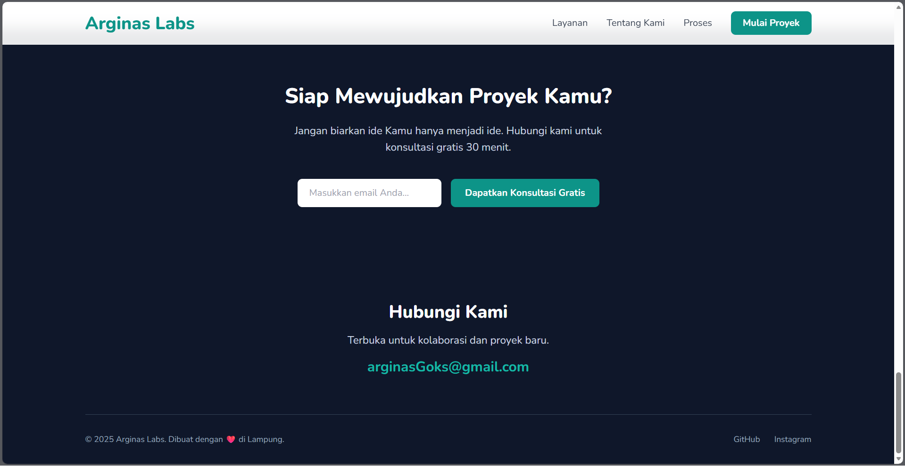

# Dhito Aryo Trengginas — CSS Framework Praktikum Pemrograman Web

  

Selamat datang! Ini adalah submission Praktikum Pemrograman Web saya untuk **Judul 3: CSS Framework & Templating** — dibuat menggunakan **Tailwind CSS**.

---

## 📝 Penjelasan Singkat

Saya Dhito Aryo Trengginas — Mahasiswa Teknik Informatika (NPM 2315061015). Tugas praktikum ini (Judul 3) menuntut pembuatan *landing page* responsif untuk perusahaan teknologi menggunakan CSS Framework.

Proyek ini adalah *landing page* untuk **"Arginas Labs"**, sebuah *creative technology studio* fiktif yang saya dirikan. Proyek ini dibangun sepenuhnya menggunakan **Tailwind CSS** (via CDN) untuk menerapkan pendekatan *utility-first* dalam membuat desain yang modern, responsif, dan estetik.

[cite_start] *Landing page* ini mencakup semua komponen yang disyaratkan [cite: 499-505] dan menampilkan POV (Point of View) saya sebagai pemilik perusahaan, dengan fokus pada *brand* yang "human-centered" dan profesional.

---

## 📸 Tampilan Halaman (Screenshots)

Berikut adalah tampilan dari setiap bagian utama *landing page* "Arginas Labs":

### 1. Hero Section
*(File: 1.png)*

### 2. Social Proof & Layanan Kami

### 3. Tentang Kami (Founder POV)

### 4. Proses Kerja

### 5. Testimoni Klien

### 6. CTA & Footer

---

## 📬 Kontak

-   **Email**: aryodhito20@gmail.com
-   **GitHub**: https://github.com/dhitoary
-   **LinkedIn**: https://www.linkedin.com/in/dhito-aryo-trengginas-1b886629

---

Terima kasih sudah melihat submission Judul 3 saya.
